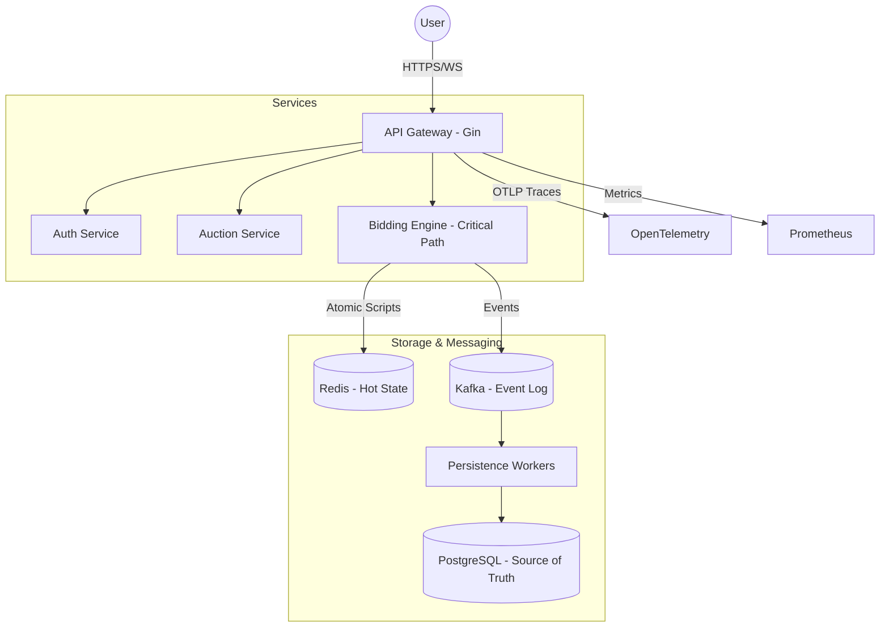

# ⚡ Real-Time Bidding System

[](https://golang.org)
[](https://gin-gonic.com)
[](https://microservices.io)

A high-performance, distributed real-time auction platform designed to handle massive concurrency spikes, guaranteed correctness, and sub-millisecond response times.

---

## 🚀 Overview

This repository demonstrates the engineering depth required to build a system like **eBay** or **Ad Exchange (RTB)**. It's not just a CRLUD app; it's a study in distributed systems, concurrency control, and scalability.

### Why this is hard:
- **The Auction Closing Spike**: Traffic can spike 1000x in the last 10 seconds of an auction.
- **Strong Correctness**: We must never lose a bid or declare a wrong winner.
- **Sub-millisecond Latency**: Users expect instant feedback in a live bidding war.

---

## 🏗️ Architecture

The system is evolving from a **Modular Monolith** to a **Distributed Microservices** architecture.



---

## 🛠️ Technology Stack

| Category | Technology |
| :--- | :--- |
| **Language** | Go (1.25+) |
| **Framework** | Gin Gonic |
| **Database** | PostgreSQL (v16+) |
| **Caching** | Redis (Lua Scripts for Atomicity) |
| **Messaging** | Kafka (Reliable Event Sourcing) |
| **Observability** | OpenTelemetry, Prometheus, Zap Logging |
| **DevOps** | Docker, Docker-Compose |

---

## ✨ Key Features (Implemented)

### 1. Production-Ready API Gateway
- **Zero-Trust Tracing**: Integrated with OpenTelemetry for end-to-end request tracing.
- **Robustness**: Panic recovery, request ID tracing, and configured server timeouts.
- **Rate Limiting**: IP-based rate limiting to protect against DDoS and abuse.
- **Observability**: Structured JSON logging and Prometheus metrics endpoint.

### 2. High-Performance Bidding Engine
- **Concurrency Control**: Designed for "The Last Second Spike" using atomic operations.
- **Reliability**: Graceful shutdown handles in-flight requests without data loss.

---

## 📚 Deep Dives (Work in Progress)

I've documented the design journey throughout the development:

1. [01-Introduction](docs/01-introduction.md) - Why this project exists.
2. [02-Requirements](docs/02-requirements.md) - Capacity planning & SLAs.
3. [03-High-Level-Architecture](docs/03-high-level-architecture.md) - System evolution.
4. [04-Deep-Dive-Bidding-Engine](docs/04-deep-dive-bidding-engine.md) - Solving race conditions.
5. [05-Scaling](docs/05-scaling.md) - Moving to Redis/Kafka.
6. [06-Realtime-Updates](docs/06-realtime-updates.md) - WebSocket fan-out.
7. [07-Consistency-and-Race-Conditions](docs/07-consistency-and-race-conditions.md) - Reliability first.
8. [08-Production-Architecture](docs/08-production-architecture.md) - Final state.

---

## 🚦 Getting Started

### Prerequisites
- [Docker](https://www.docker.com/get-started)
- [Go](https://go.dev/doc/install) (for local development)

### Running locally
```bash
# Clone the repository
git clone https://github.com/yourusername/realtime-bidding-system.git

# Initial dependencies setup
go mod tidy

# Start the API Gateway
cd services/api-gateway
touch .env # Use .env.example as a template
go run cmd/server/main.go
```

---

## 🧪 Testing

```bash
# Run all tests
go test ./...

# Benchmark the bidding path
go test -bench=. ./internal/bidding/...
```

---

## 🎨 Clean Code & Architecture
This project follows **Clean Architecture** and **Domain-Driven Design (DDD)** principles. Each service is modular, allowing for easy extraction into microservices if needed.

- **`pkg/`**: Shared libraries (Postgres, Redis, Kafka, OTel, Config).
- **`services/`**: Independent microservices.
- **`infra/`**: Terraform and Kubernetes manifests.

---

## 👨‍💻 Author

**Eslam** - [GitHub](https://github.com/eslam)

Project built with a focus on engineering excellence and scalability.
